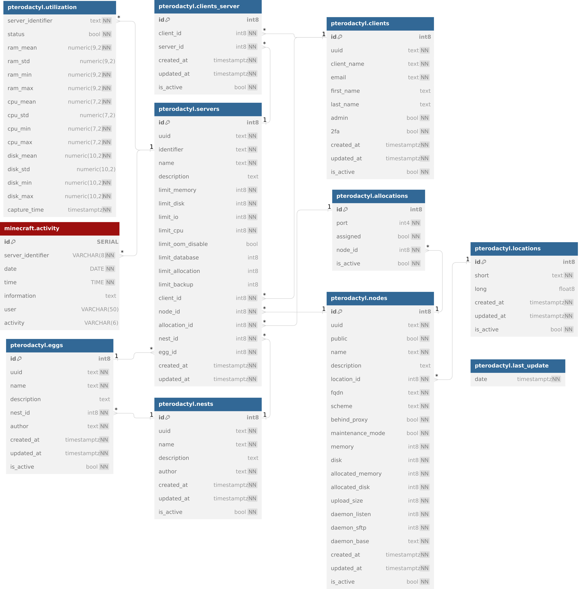

# STIV Minecraft Project

## Project Description

This project has been developed to facilitate the extraction of information from [Pterodactyl](https://pterodactyl.io), encompassing data related to servers, eggs, nodes, allocations, consumption, and other relevant aspects. Additionally, it involves retrieving information about user activity on Minecraft servers, achieved through the utilization of both the Application and Client Pterodactyl's [Python APIs](https://github.com/iamkubi/pydactyl). The project also integrates with the [PostgreSQL](https://www.postgresql.org) database using SQLalchemy. Consequently, the collected data is uploaded to PostgreSQL, enabling us to conduct subsequent analyses on our services and identify areas for improvement.


## Table of contents
* [Purpose](#purpose)
* [Requirementes before using this project](#requierements-before-using-this-project)
* [Recomendations to install and run the project](#recomendations-to-install-and-run-the-project)
* [Use the project with jupyter notebook (non production)](#use-the-project-with-jupyter-notebook-non-production)
* [Use the proyect with docker (for production)](#use-the-proyect-with-docker-for-production)

## Purpose

The primary objective of this project is to retrieve information from Pterodactyl's Minecraft servers, enabling us to assess their progress and enhance the services provided to our clients. Moreover, it provides the bases for further analysis and visualizaion to identify areas that require implementation for service improvement.

## Requierements before using this project

The initial and crucial step for utilizing this project is to ensure the presence of an active and operational [Pterodactyl](https://pterodactyl.io) Panel and Wings instance, as it serves as the primary source of information throughout the project.

Subsequently, you must have a PostgreSQL database in place. Alternatively, if you possess database expertise, you can opt for another SQL database and modify the code accordingly based on its requirements. Within this database, it is imperative to include the tables outlined in [postgres_tables_and_views](/postgres_tables_and_views), along with the specified relationships between them, as illustrated below.



The majority of these tables are designed with consideration for the relationships that exist between them, typically utilizing the 'id' or identifier to establish references. It is crucial to emphasize that the activity and consumption tables align with the contents of [pterodactyl_minecraft_logs](/development_notebook/pterodactyl_minecraft_logs.ipynb) and [pterodactyl_resource_consumption](/development_notebook/pterodactyl_resource_consumption.ipynb), respectively. Conversely, all other tables correspond to [pterodactyl_application](/development_notebook/pterodactyl_application.ipynb). Therefore, meticulous attention should be given to the creation of each table to prevent errors when loading data into PostgreSQL.

> It is expected to add a new feature in the future to create the tables automagically if the PostgreSQL instance doesn't have the expected schema created.

## How to use this project

### Use the project with Jupyter Notebook (development)

First of all, it is imperative to duplicate the `.env.example` file, rename it to `.env`, and specify your credentials for both Pterodactyl and the PostgreSQL database, or any other server you are using, within this file.

Subsequently, proceed to any of the .ipynb files and execute the following code:

```python
pip install -r requirements.txt
```

Following this process, you will have acquired all the essential [requirements](/development_notebook/requirements.txt) needed to execute the notebooks.

#### Notebook 1: pterodactyl_applications

This serves as the foundational code, responsible for gathering data related to clients, servers, locations, allocations, nodes, nests, eggs, and client-server interactions. The extracted information will be utilized in subsequent Python queries, facilitating the execution of various codes.

#### Notebook 2: pterodactyl_minecraft_logs

The primary purpose of this notebook is to extract, process, transform, and upload user activity data from each Minecraft server to the PostgreSQL database. The recorded data is stored in a straightforward manner, enabling subsequent analysis.

#### Notebook 3: pterodactyl_resource_consumption

This notebook is dedicated to obtaining information concerning the status of each server. It includes details about RAM, CPU, and disk consumption, with the extracted data subsequently uploaded to PostgreSQL for further analysis.

> To learn more details about these notebooks, please refer to the documentation available [here](/development_notebook). Alternatively, you can examine each notebook individually, but we strongly encourage you to review the documentation beforehand.

### Use the proyect with docker (for production)
To utilize all these notebooks scheduled within a Docker container, you can proceed by using the [Docker Compose Example](dockercompose/docker-compose.example.yml) provided in this project to build and run the image.

The simplest way to achieve this is to copy and paste the example into your own docker-compose.yml file:

```
version: '3.9'

services:
  pipeline:
    build:
      context: ../dockerfile/
      dockerfile: dockerfile
    environment:
      TZ: America/Santiago
      PTERODACTYL_URL: https://pterodactyl.yourdomain.com
      PTERODACTYL_APP_KEY: this_is_a_super_long_secret_application_api_key
      PTERODACTYL_CLI_KEY: this_is_a_super_long_secret_client_api_key
      POSTGRES_HOST: host
      POSTGRES_PORT: 5432
      POSTGRES_DATABASE: db
      POSTGRES_USERNAME: user
      POSTGRES_PASSWORD: pass
```

To execute this Docker Compose you just need to:

```
docker compose up -d --build
```

Before proceeding, please ensure that you have configured your own environment variables for your application. Here, you can review the purpose of each variable and find some examples that may assist you:

| Variable Name     | Description                             | Example Value        |
|-------------------|-----------------------------------------|----------------------|
| `TZ` | Set the time zone for appropriate task scheduling | `America/Santiago` |
| `PTERODACTYL_URL` | The root URL of your Pterodactyl Panel instance | `https://pterodactyl.yourdomain.com` |
| `PTERODACTYL_APP_KEY` | The **Application** API KEY of your Pterodactyl Panel | `super_long_secret_application_api_key` |
| `PTERODACTYL_CLI_KEY` | The **Client** API KEY of your Pterodactyl Panel | `super_long_secret_client_api_key` |
| `POSTGRES_HOST` | The Host address of your PostgreSQL instance | `postgres.yourdomain.com` |
| `POSTGRES_PORT` | The Port number to connect to your PostgreSQL instance | `5432` |
| `POSTGRES_DATABASE` | The name of the PostgreSQL database for Pterodactyl | `pterodactyl` |
| `POSTGRES_USERNAME` | The Username for connecting to your PostgreSQL instance | `username` |
| `POSTGRES_PASSWORD` | The Password for authenticating as the PostgreSQL User | `password` |

> Currently, the exclusive method for adjusting the time scheduling of individual tasks is by modifying the [scheduler.py](dockerfile/scheduler.py) file and subsequently rebuilding the Docker image.